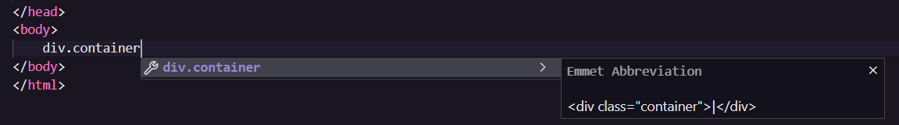

#### Ganhando Produtividade com Angular

<h1>
    <a href="https://www.dio.me/">
     </a>
    <span>Trabalhando com Web Components no Front-end</span>
</h1>

[](https://web.dio.me/course/trabalhando-com-web-components-no-front-end/learning/de8b3fd6-71a4-42d2-80b4-05f9bad77bc1?back=/track/santander-bootcamp-2023-fullstack-java-angular&tab=undefined&moduleId=undefined)
[](https://web.dio.me/course/trabalhando-com-web-components-no-front-end/learning/de8b3fd6-71a4-42d2-80b4-05f9bad77bc1?back=/track/santander-bootcamp-2023-fullstack-java-angular&tab=undefined&moduleId=undefined)

##

```bash
div.container
```
> cria uma div com o nome classe "container"




## Definindo um Component

```javascript
// Define uma nova classe JavaScript chamada CardNews que estende HTMLElement.
class CardNews extends HTMLElement {
    // Define o método construtor da classe.
    constructor() {
        // Chama o construtor da classe pai (HTMLElement) usando a palavra-chave super.
        super();

        // Cria um shadow DOM para o elemento personalizado.
        const shadow = this.attachShadow({mode: "open"});

        // Define o conteúdo do shadow DOM. Neste caso, um título h1.
        shadow.innerHTML = "<h1>Hello World</h1>";
    }
}

// Registra o elemento personalizado "card-news" com o nome da classe CardNews.
customElements.define("card-news", CardNews);
```

```html
<!-- Inclui um arquivo JavaScript externo. -->
<script src="src/Components/CardNews.js" defer></script> <!-- Define o caminho para o arquivo JavaScript e Indica que o script será carregado em segundo plano (defer) após o HTML ser analisado. -->

    <card-news></card-news>
</body>
</html>
```

## Anatomia e vantagens de Components


## Referências

[shadow dom](https://developer.mozilla.org/en-US/docs/Web/API/Web_components/Using_shadow_DOM)
[Can I use](https://caniuse.com/)
