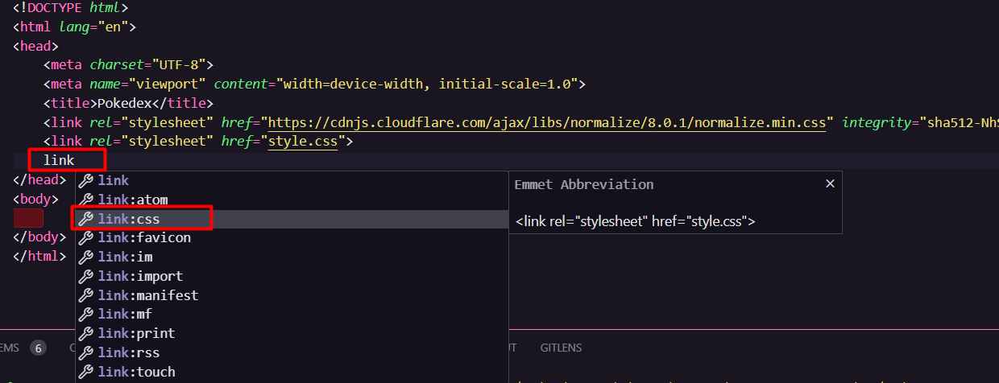

#### Primeiras páginas interativas com JavaScript

<h1>
    <a href="https://www.dio.me/">
     </a>
    <span>Criando um Projeto com HTML/CSS para Listagem de Pokémon</span>
</h1>

[](https://web.dio.me/course/criando-um-projeto-comhtml-css-para-listagem-de-pokemon/learning/00d99b8d-2af0-4085-ab74-19ff70ef32c2?back=/track/santander-bootcamp-2023-fullstack-java-angular&tab=undefined&moduleId=undefined)
[](https://web.dio.me/course/criando-um-projeto-comhtml-css-para-listagem-de-pokemon/learning/00d99b8d-2af0-4085-ab74-19ff70ef32c2?back=/track/santander-bootcamp-2023-fullstack-java-angular&tab=undefined&moduleId=undefined)

## Adicionando normalize css no projeto

Para incluir o [CDN Normalize css](https://cdnjs.com/libraries/normalize) no seu projeto adicione ao cabeçalho (head) do seu arquivo HTML para garantir que o Normalize.css seja aplicado a todas as páginas do seu projeto.

```bash
https://cdnjs.cloudflare.com/ajax/libs/normalize/8.0.1/normalize.min.css
```
 o Normalize.css estara incluído no seu projeto e será aplicado automaticamente aos estilos da página. Você pode começar a criar ou adicionar seus próprios estilos CSS personalizados ao projeto, sabendo que o Normalize.css ajudará a garantir a consistência de estilos em diferentes navegadores.

```bash
$ mkdir assets
$ mkdir assets/css
$ mkdir assets/js
$ touch ./assets/css/globa.css
$ touch ./assets/js/main.js
```

## Adicionando a imagem do Pokémon

[Pokemon API](https://pokeapi.co/docs/v2#pokemon)



## References

[Repositório Git](https://github.com/digitalinnovationone/js-developer-pokedex)
[Pokemon API](https://pokeapi.co/docs/v2#pokemon)
